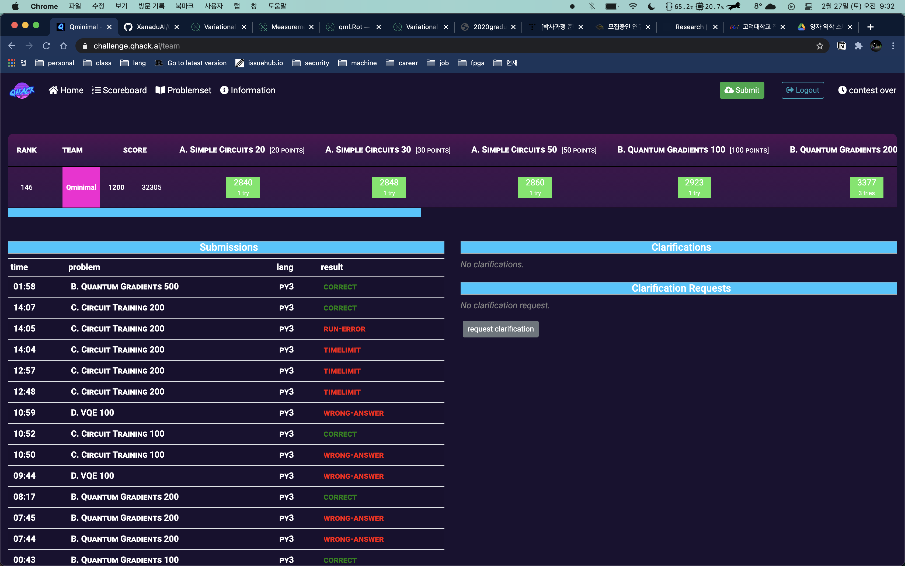

# Qhack challenge 문제풀이 
이번 2월에 pennylane에서 양자컴퓨팅challenge가([Qhack](https://github.com/XanaduAI/QHack)) 시작했습니다 \
총 12문제로 양자컴퓨팅과 관련된 문제로 구성되어 있었습니다 \
저는 그중 8문제를 풀었고 전체에서 148등을 기록을 하였습니다

여기서 제가 풀어낸 방식을 설명할려고 합니다 
| 문제이름      | 풀이여부       |
| ----------- | ----------- |
| Simple Circuits 20 | :white_check_mark:|
| Simple Circuits 30 | :white_check_mark:|
| Simple Circuits 50 | :white_check_mark:|
| Circuit Training 100 | :white_check_mark:|
| Circuit Training 200 | :white_check_mark:|
| Circuit Training 500 | :x:|
| Quantum Gradients 100 | :white_check_mark:|
| Quantum Gradients 200 | :white_check_mark:|
| Quantum Gradients 500 | :white_check_mark:|
| VQE 100 | :x:|
| VQE 200 | :x:|
| VQE 500 | :x:|
