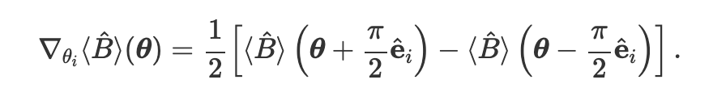

# 문제풀이
이문제의 중요한 점은 회로의 gradient를 구현하는 것입니다 \
이를 위해서는 parameter shift rule을 사용해야 합니다 \
식은 다음과 같습니다

즉 회로의 위상차가 pi 만큼 차이를 내서 서로 값을 더하면 그에 대한 기울기가 나옵니다
이를 코드로 구현하면 다음과 같습니다 
~~~python
def parameter_shift_term(qnode, params, t,i):
    shifted = params.copy()
    shifted[t,i] += np.pi/2
    forward = qnode(shifted)  # forward evaluation

    shifted[t,i] -= np.pi
    backward = qnode(shifted) # backward evaluation

    return 0.5 * (forward - backward)
~~~
이걸 이용해서 기울기 값을 가져오면 정답이 됩니다

참고: [https://pennylane.ai/qml/demos/tutorial_backprop.html](https://pennylane.ai/qml/demos/tutorial_backprop.html)
