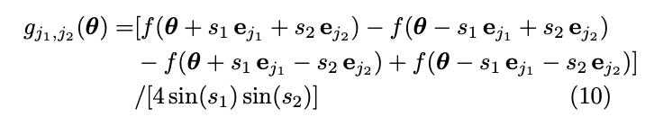

# 문제풀이
이문제는 해당 회로의 hessian 행렬을 출력하는 문제입니다 \
그래서 기울기에서 각기 다른 두인자로 두번 편미분을 진행해야 했습니다 \

두번 편미분하는 방법은 아래의 논문에 기재되어 있습니다 
[Estimating the gradient and higher-order derivatives on quantum hardware](https://arxiv.org/pdf/2008.06517.pdf)

이논문에 따르면 hessian을 구하는 식이 있는데 다음과 같습니다 \

이때 s1과 s2가 같다고 가정을 하고 s1=pi/2 로 하면 식이 간단해집니다 
이걸 코드로 표현하면 다음과 같습니다
~~~python
def parameter_second(qnode, params,grads,orig, i,j):
    shifted=params.copy()
    u_i = np.zeros(len(params))
    u_i[i]=1
    u_j =np.zeros(len(params)) 
    u_j[j]=1
    f,b = grads
    if i==j:
        return 0.5 * (b[i]- 2*orig+ f[i])
    else:
        i_1=qnode(shifted+np.pi/2*(u_i+u_j))
        i_4=qnode(shifted-np.pi/2*(u_i+u_j))
        i_2=qnode(shifted+np.pi/2*(-u_i+u_j))
        i_3=qnode(shifted+np.pi/2*(u_i-u_j))
        return  0.25 * (i_1 - i_2 - i_3 + i_4)
~~~
이 문제에서는 회로를 사용하는 횟수 제한이 있어서 기존에 계산된 값을 활용하는 방식으로 코드를 짰습니다 

이를 이용해서 문제를 해결하면 됩니다 

