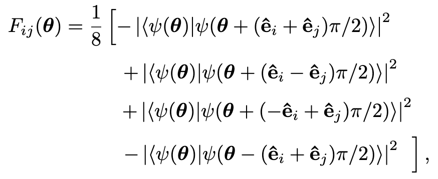

# 문제풀이 
이 문제가 조금 힘들었습니다\
Fubini–Study metric을 구현하는 문제인데 다음식을 구현해야 했습니다 

이를 위해서는 양자 회로에서 측정전의 상태를 반환하는 함수가 필요하고 이를 벡터 내적하는 함수가 필요했습니다\
양자 상태 반환은 qml.state를 이용해서 반환할 수 있었고
벡터 내적은 np.dot을 이용해 했습니다\
이를 코드로 구현하면 다음과 같습니다 
~~~python
@qml.qnode(dev)
def prob(params):
    variational_circuit(params)
    return qml.state()
~~~
~~~python
def fubu_mat(params,orig, i,j):
    shifted=params.copy()
    u_i = np.zeros(len(params))
    u_i[i]=1
    u_j =np.zeros(len(params)) 
    u_j[j]=1

    pp_1=prob(shifted+np.pi/2*(u_i+u_j))
    p_1=np.dot(orig,pp_1.conjugate())
    p_1= p_1.real**2 + p_1.imag**2

    pp_2=prob(shifted+np.pi/2*(u_i-u_j))
    p_2=np.dot(orig,pp_2.conjugate())
    p_2= p_2.real**2 + p_2.imag**2

    pp_3 =prob(shifted+np.pi/2*(-u_i+u_j))
    p_3=np.dot(orig,pp_3.conjugate())
    p_3= p_3.real**2 + p_3.imag**2
    
    pp_4 =prob(shifted-np.pi/2*(u_i+u_j))
    p_4=np.dot(orig,pp_4.conjugate())
    p_4= p_4.real**2 + p_4.imag**2
    
    return 0.125 * ( -p_1 +p_2 +p_3-p_4)
~~~
여기서 행렬을 구하고 역행렬을 만든 다음에 기울기와 곱하면 문제의 해답이 됩니다 